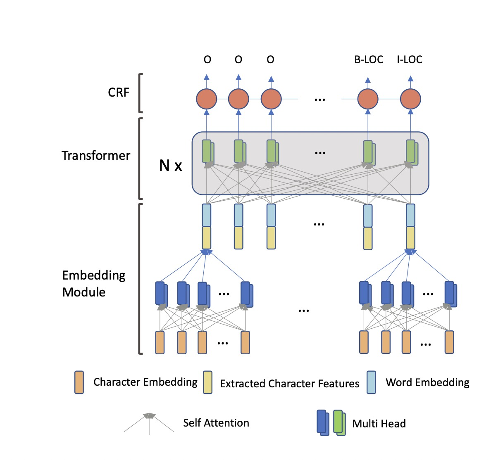

# AdaptedTransformer
原始论文为[TENER: Adapting Transformer Encoder for Named Entity Recognition](https://arxiv.org/pdf/1911.04474.pdf)

这篇论文的encoder 是哈工大的ltp的ner模型采用的encoder。
## 论文内容
这篇文章的立意在于transformer的encoder模型在ner任务上的效果不好。作者分析其原因在于：
- transformer的余弦编码形式无法表达方向，通过修改编码形式使其具备识别方向的能力，有助于获取方西与距离两个尺度上的性质；
- 其实在于transformer的attention经过了softmax进行平滑与归一化，作者认为这对于ner任务不利。每个词在ner任务中的价值是不一样的，通过一个稀疏的attention忽略掉一些不重要的词会有帮助。

模型图谱如下 

本文对ner任务的模型结构优化集中在 token-embedding 与 context-encoding 这两个部分。
1. 在 token-embedding部分，采用word embedding拼接 character encoding，再加上position embedding的形式。character encoding 本身也是一个 单层的 multi-head self-attention。
2. 本文首先着笔墨讲述了 $ PE_t^{T}PE_{t+k} $ 只与k相关，以及 $ PE_t^{T}PE_{t+k}=PE_t^{T}PE_{t-k} $ 这两件事，试图说明position embedding具备距离感知能力但对方向无感（注：但是在attention中，$PE$ 与 $PE_t$之间存在一个$W = W_q \dot W_k^T$，这里所有论证都不符合真实的场景）
3. 本文将 attention修改为 
$$
\begin{align}
&Q, K, V = HW_q, H_{d_k}, HW_v
\\&R_{t-j} = [\cdots \sin(\frac{t-j}{10000^{2i/d_k}})\cos(\frac{t-j}{10000^{2i/d_k}}) \cdots]^T
\\&A_{t,j}^{rel} = Q_tK_j^T + Q_tR_{t-j}^T + uK_j^T + vR_{t-j}^T
\\&Attn(Q,K,V) = softmax(A^{rel})V
\end{align}
$$
​		这里的 $H_{d_k}$ 是H再第2维划分后的结果，每个head对应一部分；组成$A_{t,j}^{rel}$的四部分分别代表着，原始的attention，相对距离带来的偏值，token t，j带来的偏置。

4. 回顾原始的attention层：
   $$
   \begin{align}
   &Q, K, V = HW_q, HW_k, HW_v\\
   &Attn(Q^{(h)},K^{(h)},V^{(h)})=softmax(\dfrac{QK^T}{\sqrt{d_k}})V\\
   &head(h)=Attn(Q^{(h)},K^{(h)},V^{(h)})\\
   &MultiHead(H)=[head^{1};\cdots;head^{n}]W_O
   \end{align}
   $$
   ner的数据集通常较小，作者的修改规避了连续两个参数矩阵相乘的形式。并且略去了$W_O$，而是直接作用一个ffn网络(这个网络在transformer中与bert中都存在)。

5. 关于原始attention中的平滑因子$\sqrt{d_k}$，作者的经验是去除掉平滑因子得到的模型效果更好，作者的判断是：

   ```
   没有平滑因子的模型结构更加尖锐，有利于达到预设的”NER任务中只有少数的几个词起重要“这一构想
   ```

   **？**原始的transformer中的平滑因子的作用是防止梯度消失，那么取消平滑因子不会产生这样的问题吗。

6. tag labeling部分是CRF。

## 试验结果

作者在1份英文ner数据集，5份中文ner数据集上进行了试验。均为3次试验取平均f1，embedding部分为100维的glove word embedding+30维的character encoding，中文采用了[bigram word embedding](https://arxiv.org/pdf/1805.02023.pdf)。超参数通过随机搜索获得，优化器为SGD+0.9的momentum，100epochs+16的batch size，学习率变化使用的是线性warm up，warm up rate = 0.01。中文ner结果如下：

| Models      | Weibo      | Resume         | OntoNotes4.0 | MSRA       |
| ----------- | ---------- | -------------- | ------------ | ---------- |
| BiLSTM      | 56.75      | 94.41          | 71.81        | 91.87      |
| ID-CNN      | -          | 93.75          | 62.25        | -          |
| CAN-NER     | **59.31**  | 94.94          | **73.64**    | **92.97**  |
| Transformer | 46.38±0.78 | 93.43±0.26     | 66.49±0.30   | 88.35±0.60 |
| TENER(Ours) | 58.17±0.22 | **95.00±0.25** | 72.43±0.39   | 92.74±0.27 |
| w/scale     | 57.40±0.3  | 94.00±0.51     | 71.72±0.08   | 91.67±0.23 |

作者说干不过 **CAN-NER** 的原因是那篇论文用的character和bigram embedding的维数都是100维，属于不讲武德。w/scale是attention使用了平滑因子的结果。AdatpedTransformer的性能确实全面超过了bilstm，cnn与原始的transformer，且展现了很好的鲁棒性（方差小），而去除了平滑因子之后的效果也确实更好。

英文ner比较结果与中文基本一致，略。

另外，作者还试验了不同的character encoder对模型的影响，最终结果上在各个模型上也都是AdaTrans略微有优势，CNN不落下风，其他次之。存在0.3个点内的差别。但相较于没有character encoder都好很多。

## 个人感受

这篇文章的实验部分十分详尽，展示出来的实验结果比较具备说服力。论文的设计部分总体做到了自圆其说。但仍有一些两个理论上不完善的地方，个人觉得有必要对平滑因子对原生transformer的影响做深入分析。

总的来说是一篇很值得学习的论文。


